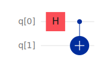

# Quantum Informatics
## Lab 2

### Task 1
$|\psi⟩ = \frac{1}{\sqrt{2}} |0⟩ - \frac{1}{\sqrt{2}} |1⟩$

#### Solution
$\alpha = \frac{1}{\sqrt{2}} = \frac{1}{\sqrt{2}} \cdot e^{i \cdot 0}$

$\beta = -\frac{1}{\sqrt{2}} = \frac{1}{\sqrt{2}} \cdot e^{i \pi}$

$|\alpha| = |\beta| = \frac{1}{\sqrt{2}}$, $\phi_1 = 0$, $\phi_2 = \pi$

##### Bloch sphere
$\theta = 2 \arccos{|\alpha|} = 2 \arcsin{|\beta|} = 2 \cdot \frac{\pi}{4} = \frac{\pi}{2}$

$\phi = \phi_2 - \phi_1 = \pi$

##### Rotation
**Y axis**: $-\frac{\pi}{2}$

#### OpenQASM
```quasm
OPENQASM 2.0;
include "qelib1.inc";

qreg q[1];

ry(-pi / 2) q[0];
```

#### Quantum circuit
[IBM Quanum Composer](https://quantum.ibm.com/composer/files/new?initial=N4IgdghgtgpiBcIAyEBGACATOgtOgKhAM4DW6AjCADQgCOxUCIA8gAoCiAcgIoCCAygFksAOgAMAbgA6YAJZgAxgBsArgBMY6KXRhLZqciPkLt0sDNoAnGAHN0tANrkAumZmWAngAocAB1noAPRYAJT2DmKuMtQgGkQKlrK%2BAC6yAPZgTCAAvkA)


### Task 2
$|\psi⟩ = \frac{\sqrt{3}}{2} |0⟩ - \frac{1}{2}i |1⟩$

#### Solution
$\alpha = \frac{\sqrt{3}}{2} = \frac{\sqrt{3}}{2} \cdot e^{i \cdot 0}$

$\beta = - \frac{1}{2}i = \frac{1}{2} \cdot e^{i \cdot \frac{3}{2} \pi}$

$|\alpha| = \frac{\sqrt{3}}{2}, |\beta| = \frac{1}{2}$, $\phi_1 = 0$, $\phi_2 = \frac{3}{2} \pi$

##### Bloch sphere
$\theta = 2 \arccos{|\alpha|} = 2 \arcsin{|\beta|} = 2 \cdot \frac{\pi}{6} = \frac{\pi}{3}$

$\phi = \phi_2 - \phi_1 = \frac{3}{2} \pi$

##### Rotation
**X axis**: $+\frac{\pi}{3}$

#### OpenQASM
```quasm
OPENQASM 2.0;
include "qelib1.inc";

qreg q[1];

rx(pi / 3) q[0];
```

#### Quantum circuit
[IBM Quanum Composer](https://quantum.ibm.com/composer/files/new?initial=N4IgdghgtgpiBcIAyEBGACATOgtOgKhAM4DWWIANCAI7FQIgDyACgKIByAigIIDKAslgB0ABgDcAHTABLMAGMANgFcAJjHQSaMBdNQBGIbLmbJYKdQBOMAObpqAbT0BdU1IsAPABQAHaegD06ADMAJR29iIuUpQgakRyFtLeAC7SAPZgDCAAvkA)


### Task 3
$|\psi⟩ = \frac{\sqrt{3}}{2} |0⟩ - \frac{1}{2} |1⟩$

#### Solution
$\alpha = \frac{\sqrt{3}}{2} = \frac{\sqrt{3}}{2} \cdot e^{i \cdot 0}$

$\beta = - \frac{1}{2} = \frac{1}{2} \cdot e^{i \pi}$

$|\alpha| = \frac{\sqrt{3}}{2}, |\beta| = \frac{1}{2}$, $\phi_1 = 0$, $\phi_2 = \pi$

##### Bloch sphere
$\theta = 2 \arccos{|\alpha|} = 2 \arcsin{|\beta|} = 2 \cdot \frac{\pi}{6} = \frac{\pi}{3}$

$\phi = \phi_2 - \phi_1 = \pi$

##### Rotation
**Y axis**: $-\frac{\pi}{3}$

#### OpenQASM
```quasm
OPENQASM 2.0;
include "qelib1.inc";

qreg q[1];

ry(-pi / 3) q[0];
```

#### Quantum circuit
[IBM Quanum Composer](https://quantum.ibm.com/composer/files/new?initial=N4IgdghgtgpiBcIAyEBGACATOgtOgKhAM4DW6AzCADQgCOxUCIA8gAoCiAcgIoCCAygFksAOgAMAbgA6YAJZgAxgBsArgBMY6KXRhLZqAIwj5C7dLAzaAJxgBzdLQDaBgLrmZVgJ4AKHAAdZdAB6CgBKB0cxNxlqEA0iBStZPwAXWQB7MCYQAF8gA)


### Task 4
$|\psi⟩ = \frac{1}{2}(|00⟩ - |01⟩ + |10⟩ - |11⟩)$

#### OpenQASM
```quasm
OPENQASM 2.0;
include "qelib1.inc";

qreg q[2];

ry(-pi / 2) q[0];
h q[1];
```

#### Quantum circuit
[IBM Quanum Composer](https://quantum.ibm.com/composer/files/new?initial=N4IgdghgtgpiBcICqYAuBLVAbGATABAMboBOhArpiADQgCOEAzlAiAPIAKAogHICKAQQDKAWXwAmAHQAGANwAdMOjCEs5XDHzz6MLOgBGARknLC2hWEV0SMAOb46AbXEBdC4pIBPABQBaAA7o%2BAD0EgCUDo7SbooAFpGGMWA0IBqMhCTo-hgA9smIIAC%2BQA)


### Entanglement
State is **not** entangled, because it may be obtained using single-qubit gates only.

### Task 5
$|\psi⟩ = \frac{1}{2}(|00⟩ + |01⟩ + |10⟩ - |11⟩)$

#### OpenQASM
```quasm
OPENQASM 2.0;
include "qelib1.inc";

qreg q[2];

h q[0];
h q[1];
cz q[0], q[1];
```

#### Quantum circuit
[IBM Quanum Composer](https://quantum.ibm.com/composer/files/new?initial=N4IgdghgtgpiBcIAyEBGACATOgtOgKhAM4DW6ArCADQgCOxUCIA8gAoCiAcgIoCCAygFksAOgAMAbgA6YAJZgAxgBsArgBMY6KXRhLZqAIwj5C7dLAzaAJxgBzdLQDamALrmZACweOxbz94M-RQAvb18qAKDqEA0iBStZAAcAF1kAezAmEABfIA)


### Entanglement
State **is entangled**, because multi-qubit gates are required to obtain it.


### Task 6
$|\psi⟩ = \frac{1}{\sqrt{2}}(|00⟩ + |11⟩)$

#### OpenQASM
```quasm
OPENQASM 2.0;
include "qelib1.inc";

qreg q[2];

h q[0];
cx q[0], q[1];
```

#### Quantum circuit
[IBM Quanum Composer](https://quantum.ibm.com/composer/files/new?initial=N4IgdghgtgpiBcIAyEBGACATOgtOgKhAM4DW6AbCADQgCOxUCIA8gAoCiAcgIoCCAygFksAOgAMAbgA6YAJZgAxgBsArgBMY6KXRhLZqAIwj5C7dLAzaAJxgBzdLQDamALrmZACweOxbmQoAPb18qbwM-MGoQDSIFK1kABwAXWQB7SMQQAF8gA)



### Entanglement
State **is entangled**, because multi-qubit gates are required to obtain it.
