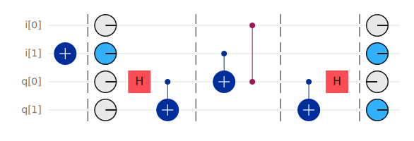
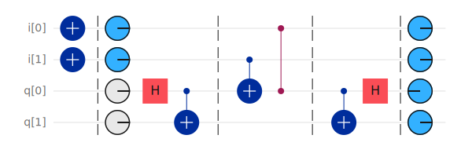
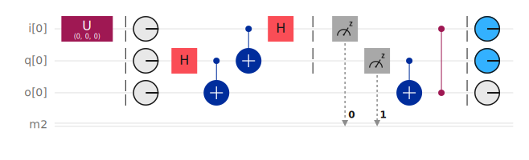
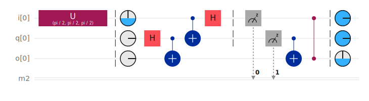
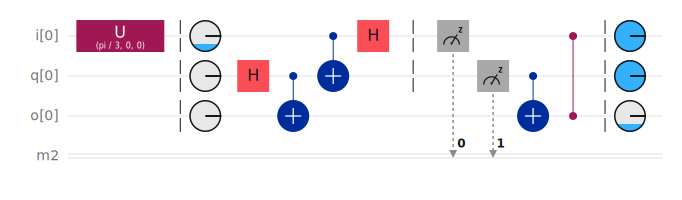

# Quantum Informatics
## Lab 4

### Task 1 - Superdense Coding

[IBM Quanum Circuit Composer](https://quantum.ibm.com/composer/files/new?initial=N4IgdghgtgpiBcIAyEBGACALOgtOgKhAM4DW6AjLugMoCuADjAE4AmMYRM6AxgPYsBLMAHMQAGhABHYlAQgA8gAUAogDkAigEFqAWXQAmAHQAGANwAdMEO4AbWm3TmpMGwNTlD1pxbCWA9H7oKBjYeISkFP6BdIys7Jw8-ELCllHo6rSoAgAuROgAZrxMiYIi6EL0tNnoAG4QdjCWkkwwwuUA2voAuj5pxsbw6O2qvOjCENkweS2StAItLF2pYAHoxuTwaQAeHcY9y6vkA9sd5Pu%2BK4HkGycC7Xum6Dt3Z72X6ABiReVQldW82QAFsx0ECIGB0AADfqQsToWhgPhQWBgarCAQ1djoVxgGAAQgOgXksQmAl4kBs6FmWVyTRabUknXOllQECYTAEIIEcMkj1WAAF6IDiDAACICUjLNL4Jjgog5MkQoTZUYAIRclKI2QmjTAgKp93O3B2jL2PPar2WrPZnOK3Kpb1WAEkwH9avVaFxuMKRFN0OSbABPUHA9BanX%2B-JU4yWY2nLrmh6xgBeuwTBqTF2tHK5PMdgRlcoV5PQrO4ZHyTF4UHQ6psmu1k1jJsN5steoz53EIDYRG4HPo2UVchAAF8gA)

#### Circuit for input: `10`


#### Circuit for input: `11`


#### OpenQASM
```quasmOPENQASM 2.0;
OPENQASM 2.0;
include "qelib1.inc";

// Lab 4 - Task 1
// Superdense coding

// Qubits for coding input value
qreg i[2];

// 00: [No gates required]

// 01:
// x i[0];

// 10:
// x i[1];

// 11:
// x i[0]; x i[1];

// For imput other than `00`, uncomment given line!

// Operational qubits
qreg q[2];

barrier i, q; // @phaseDisk


// Transition into Bell state
h q[0];
cx q[0], q[1];

barrier i, q;

// Input value changes only the state of q0
cx i[1], q[0];
cz i[0], q[0];

barrier i, q;

// Transition back from Bell state
cx q[0], q[1];
h q[0];

barrier i, q; // @phaseDisk
```


### Task 2 - Quantum Teleportation

[IBM Quanum Circuit Composer](https://quantum.ibm.com/composer/files/new?initial=N4IgdghgtgpiBcIAyEBGACALOgtOgKhAM4DW6ATLugIoCuEYALrVATADYwAOA9gE6MIjAJY8wIADQgAjsSgIQAeQAKAUQBy1AIIBlALIUAdAAYA3AB0wwsAGN2tACYx05mR2GoAjIes3XFsEsAeiD0FAxsPEJSdE9g0LoGZlZGDm5%2BQRExS3j0AEkwLlpGdGlaVGFGS2k%2BGABzdGEAbU8AXQDc2gAKYwl0Xv6ASkam43bOrq5hdFDyPqmZinnp2eHmsYD0boXQgGY%2BgeM10fHAsBD0RS4YPiFRSHZS8srq2obpFtPcxWKikrKKlUwDV6ugeJ8OudQnoYMRaLVYEx0ICiJYbG90FAmuQvmBUBA%2BHxhDdGn1pH0eKYZqEAAJcAAWxBgABFhKQcmcLvhbmAiJV7o0mDx0AAhDiPIiZGCWemlE4BGwADzlYwp8o5SpGqpVp1l61x%2BMJxL4pNKkIuMLhCJgTFRYFgVucHzGuAAfJiIZYHUR4c59W6PRsORctA4AFa0SWIxhELZ8sANMBiHBlJIsdA2HhQKC0Kw2O7ZWzK52tNVB2wALy1pbB6vEUicRHRwi4WXEiBAAF8gA)

#### Circuit for input: $U(0, 0, 0)$


#### Circuit for input: $U(\frac{\pi}{2}, \frac{\pi}{2}, \frac{\pi}{2})$


#### Circuit for input: $U(\frac{\pi}{3}, 0, 0)$


#### OpenQASM
```
OPENQASM 2.0;
include "qelib1.inc";

// Lab 4 - Task 1
// Quantum teleportation

// Input qubit
qreg i[1];

u(0, 0, 0) i;
// u(pi / 2, pi / 2, pi / 2) i;
// u(pi / 3, 0, 0) i;

// Operational qubit
qreg q[1];

// Output qubit
qreg o[1];

// Measurement bits
creg m[2];

barrier i, q, o; // @phaseDisk


// Transition into Bell state
h q;
cx q, o;

cx i, q;
h i;

barrier i, q;

// Measurements
measure q[0] -> m[1];
measure i[0] -> m[0];

// Adjustments using non-quantum communication
cx q, o;
cz i, o;

barrier i, q, o; // @phaseDisk
```
